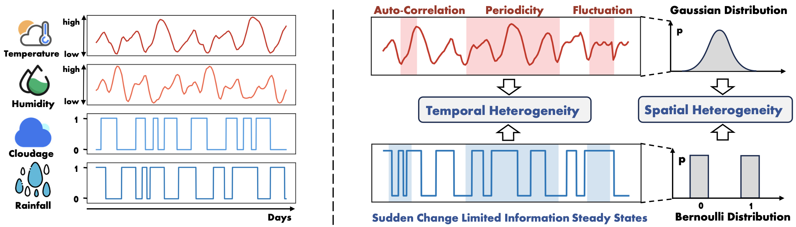
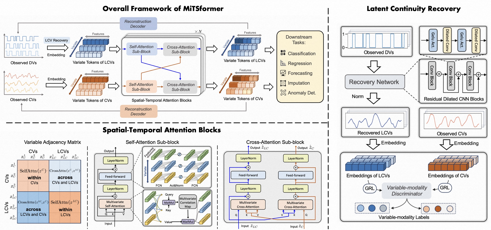
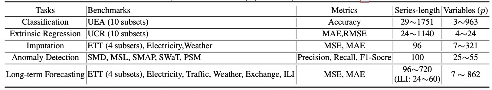

# MiTSformer
This is the PyTorch implementation of **MiTSformer** (NeurIPS 2024). 

MiTSformer is a task-general mixed time series analysis framework, which recovers and aligns latent continuity of mixed variables for complete and reliable spatial-temporal modeling, being amenable to various analysis tasks and establishing SOTA performance.

## Mixed Time Series
Mixed time series, encompassing both continuous variables and discrete variables are frequently encountered in practice. Mixed time series presents the spatial-temporal heterogeneity problem, which is caused by the discrepancies in temporal variation properties and distribution types between continuous variables and discrete variables:

## MiTSformer
MiTSformer addresses the spatial-temporal heterogeneity problem from the perspective of latent continuity recovery and alignment. The architecture and its key components of MiTSformer are shown below:

## Setup

### 1. Create conda environment(Optional)
~~~
conda create -n mitsformer -y python=3.9.7 
conda activate mitsformer
~~~

### 2. Install dependencies
Install the required packages
~~~
pip install -r requirements.txt
~~~

### 3. Prepare dataset
All the datasets used in our paper are publicly available. We provide the relevant references and links in the article. 

|Task|Dataset|Reference/Link|
|:-|:-|:-|
|Classification|UEA Archive (10 datasets)|[Link](https://www.timeseriesclassification.com/)|
|Extrinsic Regression|TSER Repository (10 datasets)|[Link](http://tseregression.org/)|
|Anomaly Detection|SMD|[Paper](https://dl.acm.org/doi/abs/10.1145/3292500.3330672)|
||MSL|[Paper](https://dl.acm.org/doi/abs/10.1145/3219819.3219845)|
||SMAP|[Paper](https://dl.acm.org/doi/abs/10.1145/3219819.3219845)|
||SWaT|[Paper](https://ieeexplore.ieee.org/abstract/document/7469060/)|
||PSM|[Paper](https://dl.acm.org/doi/abs/10.1145/3447548.3467174)|
|Imputation|ETT(4 subsets)|[Paper](https://ojs.aaai.org/index.php/AAAI/article/view/17325)|
||Weather|[Link](https://www.bgc-jena.mpg.de/wetter/)|
||Electricity|[Link](https://archive.ics.uci.edu/ml/datasets/electricityloaddiagrams20112014/)|
|Long-term Forecasting|ETT(4 subsets)|[Paper](https://ojs.aaai.org/index.php/AAAI/article/view/17325)|
||Weather|[Link](https://www.bgc-jena.mpg.de/wetter/)|
||Electricity|[Link](https://archive.ics.uci.edu/ml/datasets/electricityloaddiagrams20112014/)|
||Exchange|[Paper](https://dl.acm.org/doi/abs/10.1145/3209978.3210006)|
||ILI|[Link](https://gis.cdc.gov/grasp/fluview/fluportaldashboard.html)|

Then place the downloaded data in the corresponding folder as
~~~
./dataset/classification
./dataset/extrinsic_regression
./dataset/long_term_forecast
./dataset/imputation
./dataset/anomaly_detection
~~~

Here is a summary of supported datasets.

For each dataset, we randomly select (n = ⌊0.5p⌋) variables as DVs, whose values are first Min-max normalized and then discretized into the value of 0 or 1 with the threshold 0.5 as int(MinMax-Norm(x) > 0.5).

### 4. Train and evaluate MiTSformer.
We provide the experiment scripts for MiTSformer under the folder ./scripts/
e.g., for mixed time series classification task:
~~~
mkdir -p ./result_run_classification_logs
python -u run_classification.py --data_name 'EthanolConcentration'  |tee ./result_run_classification_logs/thanolConcentration.log
~~~

for mixed time series extrinsic regression task:
~~~
mkdir -p ./result_ext_reg_logs
python -u run_extrinsic_regression.py --data_name 'HouseholdPowerConsumption1' |tee ./result_ext_reg_logs/house1.log
~~~

for mixed time series imputation task:
~~~
mkdir -p ./result_imputation_logs
python -u run_imputation.py --data_name 'ETTh1'  --mask_rate 0.125 |tee ./result_imputation_logs/ETTh1_125.log
~~~

for mixed time series anomaly detection task:
~~~
mkdir -p ./result_ad_logs
python -u run_anomaly_detection.py --data_name 'SMD' --data 'SMD'   |tee ./result_ad_logs/SMD.log
~~~

for mixed time series long-term forecasting task:
~~~
mkdir -p ./result_long_term_forecast_logs
python -u run_long_term_forecasting.py --data_name 'ETTh1' --pred_len 96 |tee ./result_long_term_forecast_logs/ETTh1_96.log
~~~

Also, you can specify GPU and tune other hyperparameters, e.g., adding: 
~~~
--gpu 0 --d_model 128 --n_layers 1 --smooth_loss_w 0.5 --learning_rate 0.001
~~~

